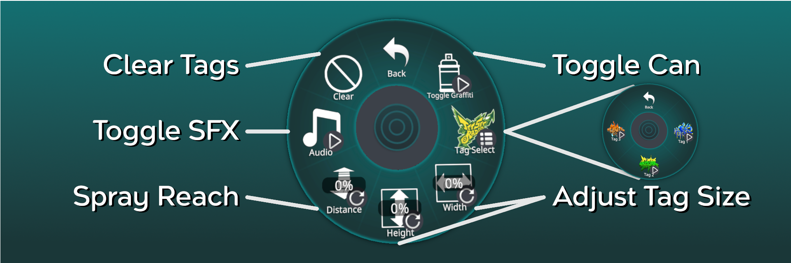

---

A fully functional graffiti can for avatars in VRChat. 
This prefab allows you to tag any opaque object in a VR chat world, even your friends.
Supports three different tag slots that are easily customizable with any graphic of your choosing.
Has customizable size control and togglable sound effects.

## Installation
The installation of the VRC graffiti can takes just a few steps:

1. Backup your avatar.
2. Download the latest `VRC_Graffiti.unitypackage` file from the Github [release page](https://github.com/AbsoluteStratos/VRC_Graffiti/releases).
3. Drag it into your Unity project which should create a `Assets/VRC_Graffiti` folder.
4. Add the prefab `Assets/VRC_Graffiti/VRC_Graffiti.prefab` to the root of your avatar.
5. Inside the prefab on your avatar, *Enable* `VRC_Graffiti/GraffitiAnchor/GraffitiCanHolder` to make the spray can visible.
6. Set the source of the parent constraint on the game object `VRC_Graffiti/GraffitiAnchor/GraffitiCanHolder` to the body part you want on your avatar (for hand use the wrist target).
7. Adjust the location/rotation/scale of the game object `VRC_Graffiti/GraffitiAnchor/GraffitiCanHolder/VRCSprayCanModel` in a way that makes sense for your avatar (make sure the can is facing the right way).
8. *Disable* `VRC_Graffiti/GraffitiAnchor/GraffitiCanHolder` once your done.
9. Update the following avatar properties:
    * Expression menu with `Assets/VRC_Graffiti/VRC_Graffiti_Menu.asset`
    * Expression parameters with `Assets/VRC_Graffiti/VRC_Graffiti_Parameters.asset`
    * FX graph with `Assets/VRC_Graffiti/VRC_Graffiti_Controller.asset`

If you already have some custom controls / animations, adjust the last step accordingly (e.g. add the `VRC_Graffiti_Menu` as a sub-menu to your existing expression menu). I'm assuming you know what you're doing at this point.

## Controls

With the graffiti can active, use the following gesture controls (any hand):

| Toggle Guide (Point)     | Apply Tag (Thumbs Up) |
| ----------- | ----------- |
|       |        |

## Customize

Customizing your tags takes only three steps:

1. Add the the image you want to be your tag to your Unity project (I recommend the tag folder under `VRC_Graffiti/Materials/Tags`). Create a copy of the image for the menu icon.
2. For the tag slot of your choosing (1-3), replace the texture on the tag decal object material located under `VRC_Graffiti/GraffitiAnchor/Tags/DecalTag#` in the prefab on your avatar.
3. Update the icon of the tag you editted in the `VRC_Graffiti/VRC_Graffiti_Tag_Menu.asset` file.

## F.A.Q.

| Does this work in any VRC world on any object?

*Generally* speaking yes, but not transparent objects. 
Anything that with an opaque material should work fine.
Additionally, this will fail to function entirely in some worlds.
If you're on a popular world where it doesnt work, drop a comment on the [open issue](https://github.com/AbsoluteStratos/VRC_Graffiti/issues/1) with the world name.

| Why does it make my avatar poor? Is there a way to get around this?

Its poor because theres a inactive light in the prefab. This light allows the graffiti to work across VRC worlds, but is not essential. 
The light, "DepthLight", can be removed but at the cost of limiting functionality of the graffiti to a much smaller number of VRC worlds (e.g. this will break things on maps like The Black Cat or The Great Pug).

| Does this work for VRC SDK version xx.xx.xx?

Odds are yes, the shield up top indicates which verion I have personally tested but compatability with newer/older versions is very likely but not "officially" supported.

## Contact / Support

If you find an issue / bug, have a feature request or have a question, create an issue on this repo.
Support isn't guaranteed, but its the best way to get into contact with me.

*If you enjoy this project, support my work by simply starring this repo! Thanks Spartan!*
