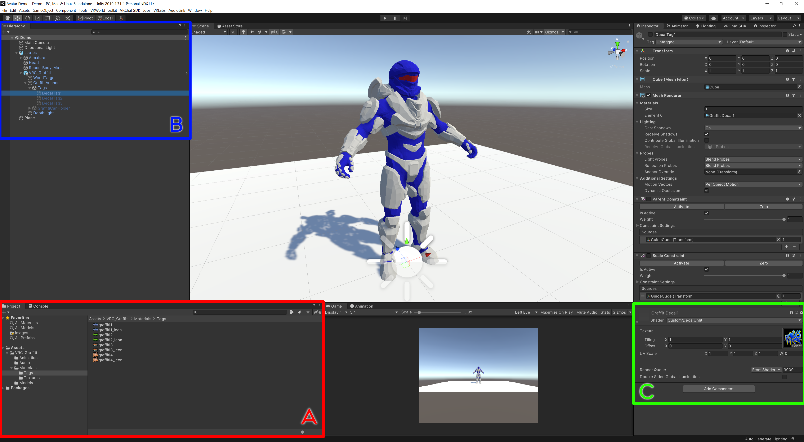
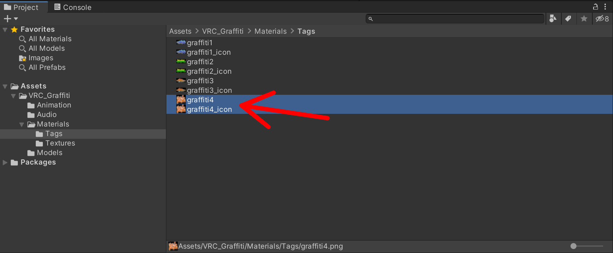
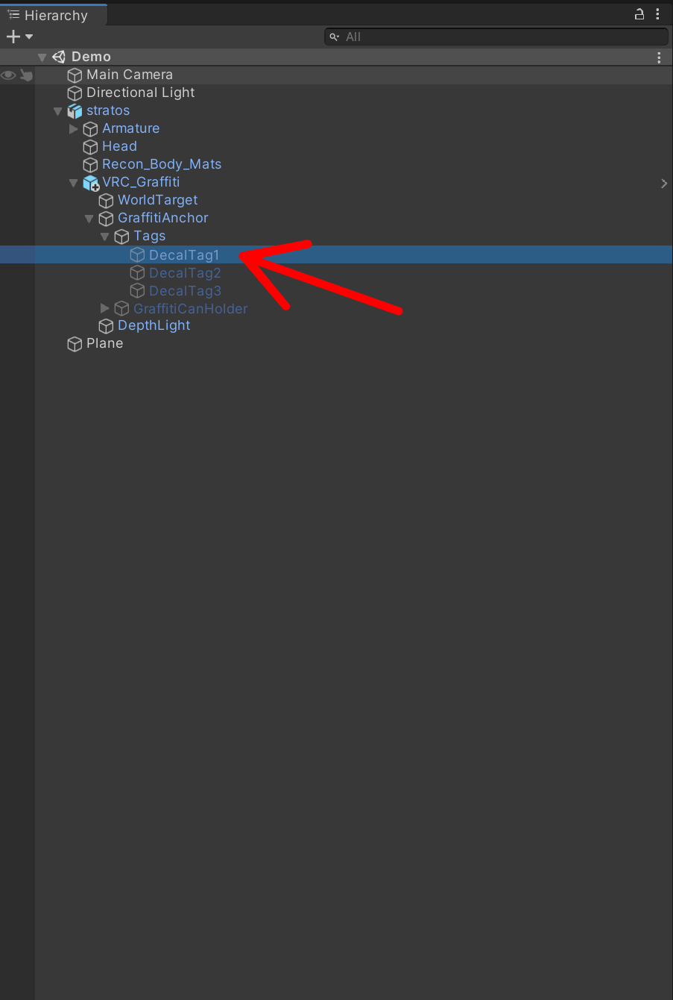
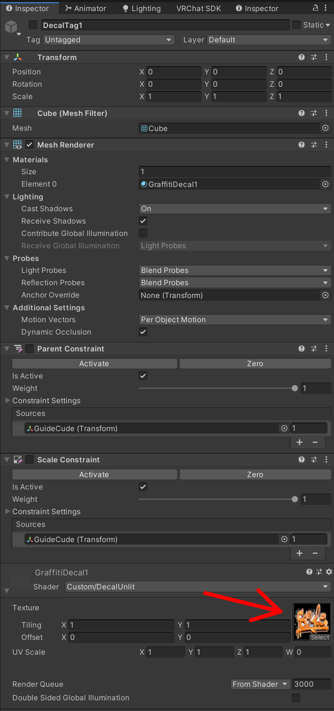
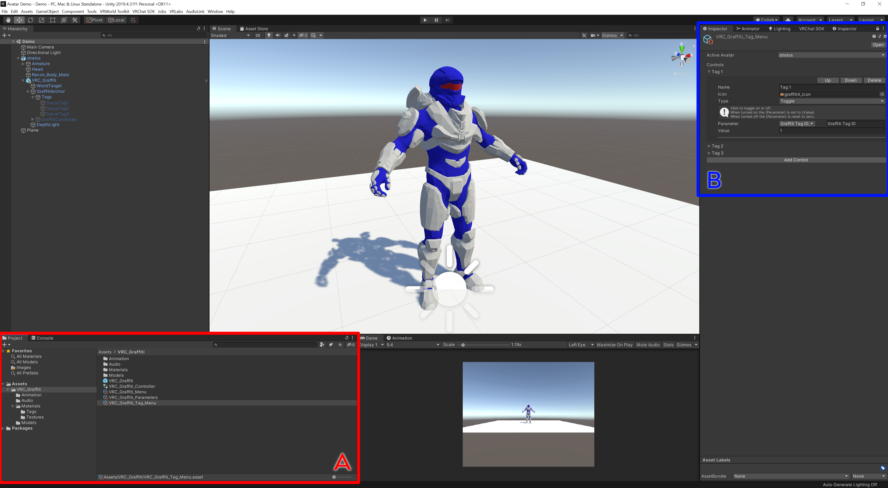
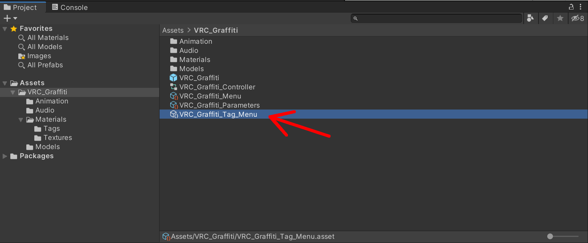
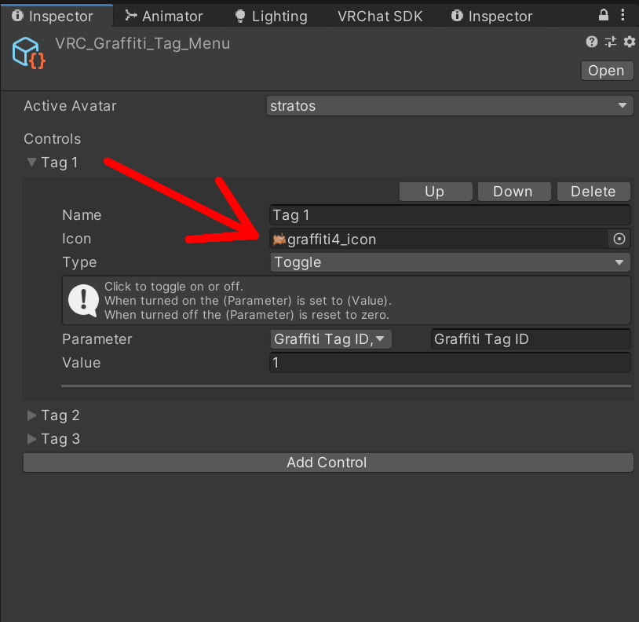

# VRC Graffiti Can Tag Customization Guide

The best part of this prefab is customizing the tags with any image you want. 
So get creative, because I'm not.
This guide is for people that are newer to Unity / avatar creation, there is a condensed form in the [README.md](../README.md).

## Step 1 Update Decal Material
Add the the image you want to be your tag to your Unity project (I recommend the tag folder under `VRC_Graffiti/Materials/Tags`). 
Create a copy of the image for the menu icon (e.g. have `myimage.png` and `myimage_icon.png`).
For the tag slot of your choosing (1-3), replace the texture on the tag decal object material located under `VRC_Graffiti/GraffitiAnchor/Tags/DecalTag#` in the prefab on your avatar.

<table style="width:100%">
<tr>
<td class = "preview">

</td>
</tr>
</table>

<table>
<tr>
<th>A</th><th>B</th><th>C</th>
</tr>
<tr>
<td class = "content" style="width:50%">

</td>
<td class = "content" style="width:25%">

</td>
<td class = "content" style="width:25%">

</td>
</tr>
</table>

## Step 2 Update Tag Menu Icon
The next step is to update the tag menu icon with your icon image in the `VRC_Graffiti/VRC_Graffiti_Tag_Menu.asset`.
The reason its good to have a seperate icon image is that VRC will downscale your image for the menu which would make your tag look pixely.
Thats it, you should be ready to upload.

<table style="width:100%">
<tr>
<td class = "preview">

</td>
</tr>
</table>

<table>
<tr>
<th>A</th><th>B</th>
</tr>
<tr>
<td class = "content" style="width:70%">

</td>
<td class = "content" style="width:30%">

</td>
</tr>
</table>