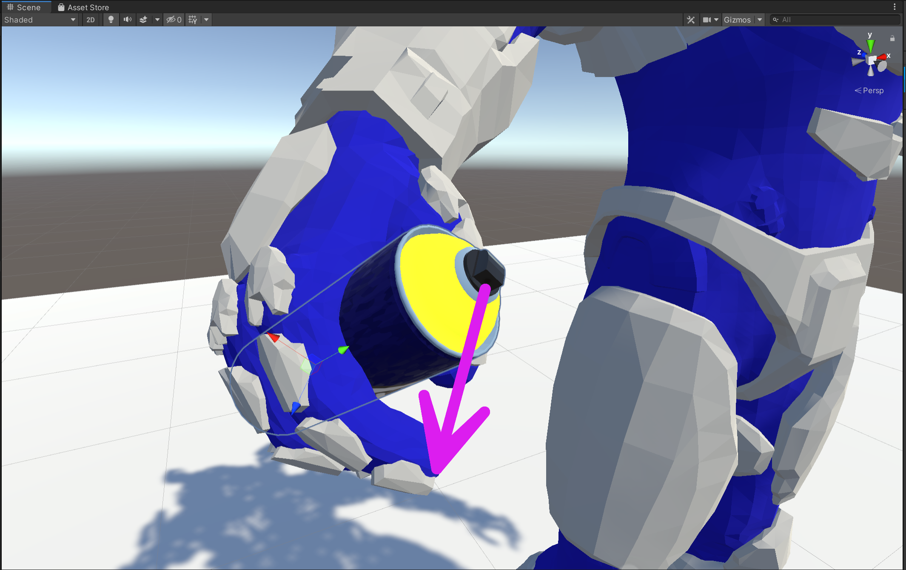

# VRC Graffiti Can Install Guide

This is a detailed install guide for those that are maybe newer to Unity / avatar creation.
Once you've done this once, following the steps in the [README.md](../README.md) should be straight forward.

Through out the tutorial click on an image to see the enlarged version. This may help to find something you're struggling to see.

## Unity Setup
For consistency, this is the layout my Unity editor is in for this tutorial.
This should be (close to) the default layout.
Prior to starting this you should have your avatar added with a VRC avatar descriptor attached.
If you're not too familiar with Unity, I would suggest setting things up in a similar way.

## Step 0 Back Up Your Avatar
Do it.

## Step 1 Installing
First step is to download the latest `VRC_Graffiti.unitypackage` file from the Github [release page](https://github.com/AbsoluteStratos/VRC_Graffiti/releases).
Once downloaded, add this to your Unity project.
You can do this by simply dragging it into your assets folder.
You'll be prompted with an import window, import everything.
This should spawn a `VRC_Graffiti` folder in your assets.
Inside `Assets/VRC_Graffiti` find the `VRC_Graffiti` prefab and add this to the root of your avatar model.

<table style="width:100%">
<tr>
<td class = "preview">

</td>
</tr>
</table>

<table>
<tr>
<th>A</th><th>B</th><th>C</th><th>D</th>
</tr>
<tr>
<td class = "content" style="width:20%">

</td>
<td class = "content" style="width:30%">

</td>
<td class = "content" style="width:30%">

</td>
<td class = "content" style="width:20%">

</td>
</tr>
</table>

## Step 2 Parenting the Spray Can
Inside the prefab on your avatar, *Enable* `VRC_Graffiti/GraffitiAnchor/GraffitiCanHolder` to make the spray can visible.
Now we need to bind the spray can to your avatar so it moves with your body.
Set the source of the parent constraint on the game object `VRC_Graffiti/GraffitiAnchor/GraffitiCanHolder` to the body part you want on your avatar.
This can be easily done by just dragging the bone of interest in your armature into the parent constraint property of the `GraffitiCanHolder`.

<table style="width:100%">
<tr>
<td class = "preview">

</td>
</tr>
</table>

<table>
<tr>
<th>A</th><th>B</th><th>C</th><th>D</th>
</tr>
<tr>
<td class = "content" style="width:20%">

</td>
<td class = "content" style="width:30%">

</td>
<td class = "content" style="width:20%">

</td>
<td class = "content" style="width:30%">

</td>
</tr>
</table>

## Step 3 Transform Spray Can Position
Adjust the location/rotation/scale of the game object `VRC_Graffiti/GraffitiAnchor/GraffitiCanHolder/GraffitiObject` in a way that makes sense for your avatar.
This object is NOT the one you just parented, its a tier down.
Keep an eye out for the nozzle of spray can to indicate the frontward direction (you want this pointing away from you).
Once your happy with its position *disable* `VRC_Graffiti/GraffitiAnchor/GraffitiCanHolder` (NOT `GraffitiObject`, this should stay enabled underneath).

<table style="width:100%">
<tr>
<td class = "preview">

</td>
</tr>
</table>

<table style="width:100%">
<tr>
<th>A</th><th>B</th><th>C</th><th>D</th><th>E</th>
</tr>
<tr>
<td class = "content" style="width:15%">

</td>
<td class = "content" style="width:20%">

</td>
<td class = "content" style="width:30%">

</td>
<td class = "content" style="width:15%">

</td>
<td class = "content" style="width:20%">

</td>
</tr>
</table>

## Step 4 Assign Avatar Properties
**If you already have a FX layer, avatar parameters or an expressions menu, skip to *Step 4 Update Avatar Properties* below.**
In the case you have none of these, the last step is easy. 
Populate the following fields attributes of your avatar descriptor:

* Add expression sub-menu with `Assets/VRC_Graffiti/VRC_Graffiti_Menu.asset`
* Add expression parameters with `Assets/VRC_Graffiti/VRC_Graffiti_Parameters.asset`
* Add FX layer with `Assets/VRC_Graffiti/VRC_Graffiti_Controller.asset`

That should be it, if you've followed these steps correctly you should be ready to upload. 
If you want customize your graffiti tags have a look at [CUSTOMIZE.md](./CUSTOMIZE.md) for more detailed instructions than the [README.md](../README.md).

<table style="width:100%">
<tr>
<td class = "preview">

</td>
</tr>
</table>

<table>
<tr>
<th>A</th><th>B</th><th>C</th>

</tr>
<tr>
<td class = "content" style="width:20%">

</td>
<td class = "content" style="width:60%">

</td>
<td class = "content" style="width:20%">

</td>
</tr>
</table>

## Step 4 Update Avatar Properties
The following steps are for users that already have their avatar set up and need to simply append their FX layer, parameters and expressions menu.
For the first two, I will be using the [VRLabs avatar manager](https://github.com/VRLabs/Avatars-3.0-Manager) which comes with the Avatar 3.0 setup using the [Creator Companion](https://vcc.docs.vrchat.com/).
I am using version 2.0.20 at the time of writing this.
If you are not using the creator companion, you probably should be.
You can open the avatar manager from the top menu.

<table style="width:100%">
<tr>
<td class = "preview">

</td>
</tr>
</table>

<table style="width:100%">
<tr>
<th>A</th>
</tr>
<tr>
<td style="width:60%">

</td>
</tr>
</table>

### Step 4a Avatar Manager
With the avatar manager open the next step is to add the `Assets/VRC_Graffiti/VRC_Graffiti_Controller.asset` to your existing FX layer.
Add your avatar descriptor to the top of the manager, then click "Add Animator to Merge" which should bring up a slot for you to drag in the VRC Graffiti controller.
Click "Merge to Current" and the animation controller for VRC Graffiti should be added to your FX layer controller.

Next switch to the expressions parameter tab in the avatar manager.
Drag in the `Assets/VRC_Graffiti/VRC_Graffiti_Parameters.asset` into the "Parameters to copy" slot and then click "Copy Parameters".

<table style="width:100%">
<tr>
<th>A</th><th>B</th><th>C</th><th>D</th>
</tr>
<tr>
<td class = "content" style="width:25%">

</td>
<td class = "content" style="width:25%">

</td>
<td class = "content" style="width:25%">

</td>
<td class = "content" style="width:25%">

</td>
</tr>
</table>

### Step 4b Adding a Sub-Menu
Finally add the `Assets/VRC_Graffiti/VRC_Graffiti_Menu.asset` as a sub-menu to your existing expressions menu.
If you want an icon for it, I recommend using the one located in `Assets/VRC_Graffiti/Materials/Textures/js.png`.
That should be it, hopefully you're ready for upload.

<table style="width:100%">
<tr>
<td class = "preview">

</td>
</tr>
</table>

<table>
<tr>
<th>A</th><th>B</th><th>C</th>

</tr>
<tr>
<td class = "content" style="width:20%">

</td>
<td class = "content" style="width:50%">

</td>
<td class = "content" style="width:30%">

</td>
</tr>
</table>
